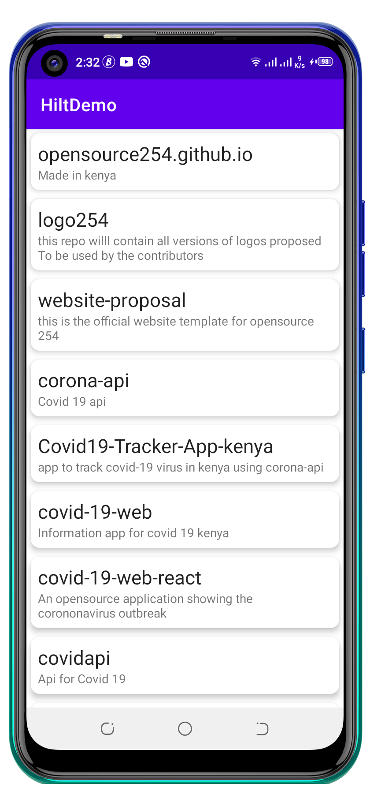

<p align="center">

# HiltDemo

A simple app that consumes Github REST API to display public repositories in the opensource254 org here on github. I was trying to learn about dependency injection with dagger hilt, built with clean architecture principles and jetpack libraries.

Min Api Level : 16 

## Setup Requirements

- Android device or emulator
- Android Studio

## Getting Started

In order to get the app running yourself, you need to:

1.  clone this project
2.  Import the project into Android Studio
3.  Connect the android device with USB or just use your emulator
4.  In Android Studio, click on the "Run" button.

## Libraries

Libraries used in the whole application are:

- [Kotlin](https://developer.android.com/kotlin) - Kotlin is a programming language that can run on JVM. Google has announced Kotlin as one of its officially supported programming languages in Android Studio; and the Android community is migrating at a pace from Java to Kotlin
- [Viewmodel](https://developer.android.com/topic/libraries/architecture/viewmodel) -The ViewModel class is designed to store and manage UI-related data in a lifecycle conscious way
- [LiveData](https://developer.android.com/topic/libraries/architecture/livedata) -  A lifecycle-aware data holder with the observer pattern
- [Kotlin Coroutines](https://developer.android.com/kotlin/coroutines) - A concurrency design pattern that you can use on Android to simplify code that executes asynchronously
- [Retofit](https://square.github.io/retrofit) -  Retrofit is a REST Client for Java and Android by Square inc under Apache 2.0 license. Its a simple network library that used for network transactions. By using this library we can seamlessly capture JSON response from web service/web API.
- [Hilt](https://developer.android.com/training/dependency-injection/hilt-android) -  A dependency injection library for Android that reduces the boilerplate of doing manual dependency injection in your project
- [Navigation Components](https://developer.android.com/guide/navigation/navigation-getting-started) -  Helps you implement navigation, from simple button clicks to more complex patterns, such as app bars and the navigation drawer.
- [Logging Interceptor](https://github.com/square/okhttp/blob/master/okhttp-logging-interceptor/README.md) -  logs HTTP request and response data.
- [Material Libarary](https://material.io/develop/android) -  Modular and customizable Material Design UI components for Android 


## Demo

<p float="left">

  </p>

## Contributors

- Thanks to [Yet Another Dev](https://www.youtube.com/channel/UCWg_fMIBrLDUf2Z5wMh_6rw) for amazing tutorial on Dagger Hilt

## Support

- Found this project useful ❤️? Support by clicking the ⭐️ button on the upper right of this page. ✌️
- Notice anything else missing? File an issue 
- Feel free to contribute in any way to the project from typos in docs to code review are all welcome.

## Get in touch - Let's be friends

Please feel free to contact me if you have any questions, ideas or even if you just want to say hi. I’m up for talking, exchange ideas, collaborations or consults. You can connect with me through any of the avenues listed below:
- [Twitter](https://twitter.com/_joelkanyi)
- [Github](https://github.com/JoelKanyi)
- [Facebook](https://www.facebook.com/joel.kanyi.71)
- [LinkedIn](https://www.linkedin.com/in/joel-kanyi-037270174/) 

## References

- https://developer.android.com/jetpack/
- https://docs.github.com/en/rest/overview/endpoints-available-for-github-apps

## License

 ```
   Copyright 2021 Joel Kanyi
   
   Licensed under the Apache License, Version 2.0 (the "License");
   you may not use this file except in compliance with the License.
   You may obtain a copy of the License at

       http://www.apache.org/licenses/LICENSE-2.0

   Unless required by applicable law or agreed to in writing, software
   distributed under the License is distributed on an "AS IS" BASIS,
   WITHOUT WARRANTIES OR CONDITIONS OF ANY KIND, either express or implied.
   See the License for the specific language governing permissions and
   limitations under the License.
